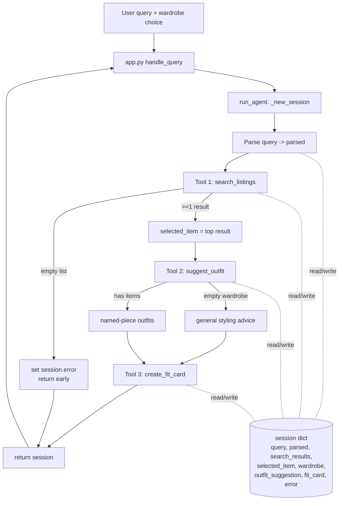

# FitFindr — planning.md

> Complete this document before writing any implementation code.
> Your spec and agent diagram are what you'll use to direct AI tools (Claude, Copilot, etc.) to generate your implementation — the more specific they are, the more useful the generated code will be.
> Your planning.md will be reviewed as part of your submission.
> Update it before starting any stretch features.

---

## Tools

List every tool your agent will use. For each tool, fill in all four fields.
You must have at least 3 tools. The three required tools are listed — add any additional tools below them.

### Tool 1: search_listings

**What it does:**
Searches the mock listings dataset (40 secondhand items loaded via `load_listings()`) and returns the items that match the user's description, optionally filtered by size and price. This is pure Python (filtering + keyword scoring) — no LLM call — so it's fast and deterministic.

**Input parameters:**
- `description` (str): Free-text keywords describing the desired item, e.g. `"vintage graphic tee"`. Tokenized and matched against each listing's `title`, `description`, and `style_tags`.
- `size` (str | None): Size string to filter by, e.g. `"M"`. Matched case-insensitively as a substring so `"M"` matches `"S/M"`, `"M/L"`, etc. `None` skips the size filter.
- `max_price` (float | None): Inclusive price ceiling. `None` skips the price filter.

**What it returns:**
A `list[dict]` of matching listings, sorted by relevance score (highest first). Each dict is a full listing with: `id, title, description, category, style_tags, size, condition, price, colors, brand, platform`. Returns an empty list `[]` when nothing matches — it never raises.

**What happens if it fails or returns nothing:**
Returns `[]`. The planning loop detects the empty list, sets a helpful `session["error"]` ("No listings matched 'X' under $Y in size Z — try removing the size filter or raising your budget"), and stops **before** calling `suggest_outfit`. (Stretch: retry with loosened constraints instead of stopping.)

---

### Tool 2: suggest_outfit

**What it does:**
Given one listing (the item the user is considering) and the user's wardrobe, asks the LLM to propose 1–2 complete outfits that pair the new item with specific pieces the user already owns.

**Input parameters:**
- `new_item` (dict): A single listing dict, normally `session["selected_item"]` (the top search result).
- `wardrobe` (dict): A dict with an `"items"` key holding a list of wardrobe-item dicts (`id, name, category, colors, style_tags, notes`). May have an empty `items` list.

**What it returns:**
A non-empty `str` of styling advice. With a populated wardrobe it names actual pieces ("pair with your Baggy straight-leg jeans and Chunky white sneakers"). With an empty wardrobe it returns general styling guidance for the item instead.

**What happens if it fails or returns nothing:**
Empty wardrobe → branch to a "general styling advice" prompt (handled, not an error). LLM/network failure → catch the exception and return a plain-text fallback string describing how the item could be styled, so the loop can still proceed to the fit card.

---

### Tool 3: create_fit_card

**What it does:**
Turns the chosen item plus the outfit suggestion into a short, casual, shareable caption — the kind of thing you'd put on an OOTD post — using a higher LLM temperature so the output varies for different inputs.

**Input parameters:**
- `outfit` (str): The styling text returned by `suggest_outfit`.
- `new_item` (dict): The selected listing dict, used to mention the item name, price, and platform naturally.

**What it returns:**
A 2–4 sentence caption `str`. Casual and authentic, mentions item name / price / platform once each, captures the outfit vibe, and reads differently each run.

**What happens if it fails or returns nothing:**
If `outfit` is empty or whitespace-only, return a descriptive error string (e.g. "Can't write a fit card without an outfit suggestion") rather than raising. LLM/network failure → caught and returned as a short fallback caption built from the item fields.

---

### Additional Tools (if any)

None for the core build. (Stretch candidate: `compare_price(item)` — estimates whether the item's price is fair against comparable listings in the same category.)

---

## Planning Loop

**How does your agent decide which tool to call next?**

The loop is a state-driven sequence of guarded steps over a single `session` dict, not a fixed pipeline — each step's outcome decides whether the next one runs:

1. **Parse** the query into `{description, size, max_price}` and store it in `session["parsed"]`.
2. **Search.** Call `search_listings(**parsed)`. **Decision point:** if the result list is empty, set `session["error"]` and **return early** — the loop never advances to styling on empty input. Otherwise store results and select the top one as `session["selected_item"]`.
3. **Suggest.** Call `suggest_outfit(selected_item, wardrobe)`. The tool itself branches on whether the wardrobe is empty (named-piece outfits vs. general advice). Store the result.
4. **Fit card.** Call `create_fit_card(outfit, selected_item)` and store it.
5. **Done** when `fit_card` is set, or earlier if any step set `error`.

The agent's behavior changes based on what came back: zero search results short-circuits the run; an empty wardrobe changes how `suggest_outfit` is prompted. It's "done" when either the fit card exists or an error was recorded.

---

## State Management

**How does information from one tool get passed to the next?**

All state lives in one `session` dict created by `_new_session()` and threaded through every step — it's the single source of truth. Each tool reads what it needs from the session and writes its output back:

- `query` → read by the parse step, which writes `parsed`.
- `parsed` → feeds `search_listings`, which writes `search_results`.
- top of `search_results` → written to `selected_item`.
- `selected_item` + `wardrobe` → feed `suggest_outfit`, which writes `outfit_suggestion`.
- `outfit_suggestion` + `selected_item` → feed `create_fit_card`, which writes `fit_card`.
- `error` is set by any step that fails and is checked first by the caller (`app.py`).

The user never re-enters the item between steps: the listing found by search flows directly into styling and then the caption because it persists in `session["selected_item"]`.

---

## Error Handling

For each tool, describe the specific failure mode you're handling and what the agent does in response.

| Tool | Failure mode | Agent response |
|------|-------------|----------------|
| search_listings | No listings match the description / size / price filters (returns `[]`) | Loop sets a specific `session["error"]` naming what was searched and suggesting how to loosen it, then returns early — does **not** call `suggest_outfit`. |
| suggest_outfit | Wardrobe is empty (`items == []`); or LLM/network error | Empty wardrobe → switch to a general-styling-advice prompt and still return useful text. LLM error → caught, returns a plain fallback styling string so the run continues. |
| create_fit_card | `outfit` string is empty/whitespace, or LLM/network error | Empty outfit → return a descriptive error string (no raise). LLM error → caught, returns a simple caption built from the item's name/price/platform. |

---

## Architecture

---

## AI Tool Plan

**Milestone 3 — Individual tool implementations:**
I'll use Claude. For each tool I'll paste that tool's section from this planning.md (inputs, return value, failure mode) plus the existing function stub and docstring from `tools.py`, and ask it to implement just that one function using `load_listings()` / the Groq client already scaffolded. I'll verify before trusting:
- `search_listings`: test "vintage graphic tee" (expect lst_006/lst_033 to rank high), test with `size="M"` and `max_price=20`, and test the no-result query "designer ballgown XXS" (expect `[]`).
- `suggest_outfit`: run once with the example wardrobe (check it names real pieces) and once with the empty wardrobe (check it gives general advice, no crash).
- `create_fit_card`: run twice on the same item (check the captions differ) and once with `outfit=""` (check it returns an error string, not a crash).

**Milestone 4 — Planning loop and state management:**
I'll give Claude the Planning Loop + State Management + Architecture sections plus the `run_agent` stub, and ask it to fill the loop matching the session-dict contract exactly. I'll verify with the two `__main__` cases in `agent.py` (happy path graphic tee → all three outputs populated, `error is None`; no-result query → `error` set and `outfit_suggestion`/`fit_card` are `None`).

---

## A Complete Interaction (Step by Step)

In plain terms: FitFindr takes one natural-language thrifting request and a wardrobe, then runs three tools in order — search the listings, style the best find against the user's closet, and write a shareable caption — passing each result forward through a shared session. Search is what kicks off the run; if it finds nothing the agent stops there with a helpful message instead of styling an empty item; otherwise the top listing flows into the outfit suggestion and then into the fit card.

**Example user query:** "I'm looking for a vintage graphic tee under $30. I mostly wear baggy jeans and chunky sneakers. What's out there and how would I style it?"

**Step 1:** `run_agent` builds the session and parses the query into `{description: "vintage graphic tee", size: None, max_price: 30.0}`, then calls `search_listings("vintage graphic tee", size=None, max_price=30.0)`. It returns matches like **lst_006 "Graphic Tee — 2003 Tour Bootleg Style" ($24, depop)** and **lst_033 "Vintage Band Tee — Faded Grey" ($19, depop)**, ranked by keyword overlap. The loop checks: list is non-empty, so it sets `selected_item` to the top result and continues.

**Step 2:** Using the returned item, the loop calls `suggest_outfit(new_item=<graphic tee>, wardrobe=<example wardrobe>)`. The wardrobe has items, so the LLM returns named-piece advice, e.g. "Wear it with your Baggy straight-leg jeans and Chunky white sneakers; throw the Vintage black denim jacket over the top for a 90s streetwear look." Stored in `outfit_suggestion`.

**Step 3:** The loop calls `create_fit_card(outfit=<that suggestion>, new_item=<graphic tee>)`, which returns a casual caption, e.g. "found this faded bootleg tee on depop for $24 and it's already my most-worn 🖤 styled it with my baggy jeans + chunky sneakers — full fit in stories." Stored in `fit_card`.

**Final output to user:** The three UI panels show (1) the top listing details, (2) the outfit idea, and (3) the fit card. On the error path (e.g. "designer ballgown size XXS under $5"), search returns `[]`, the agent sets `session["error"]`, and only the first panel shows the "no matches — try loosening your filters" message while the other two stay empty.
